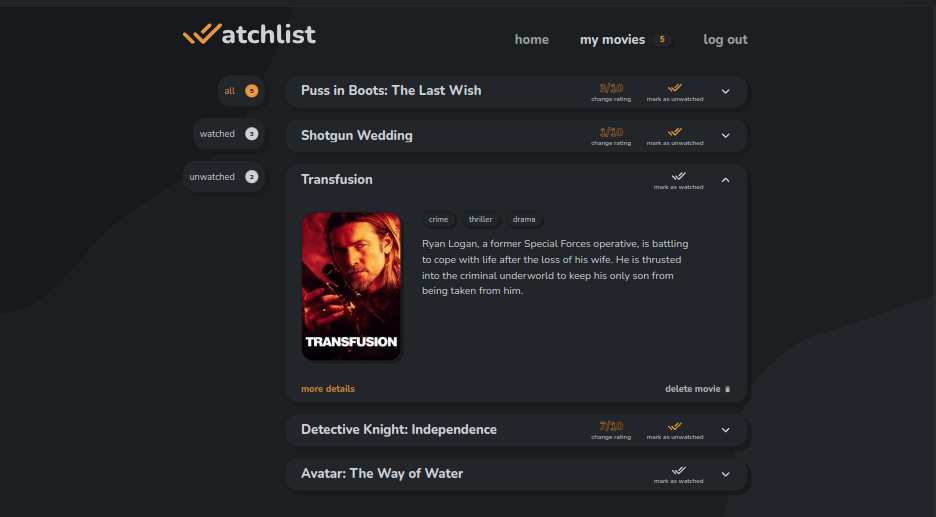
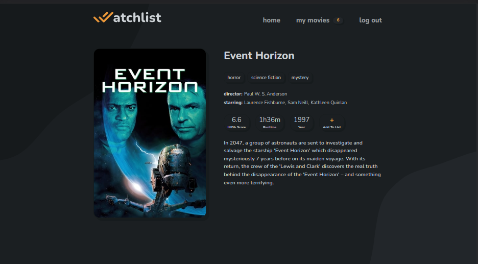
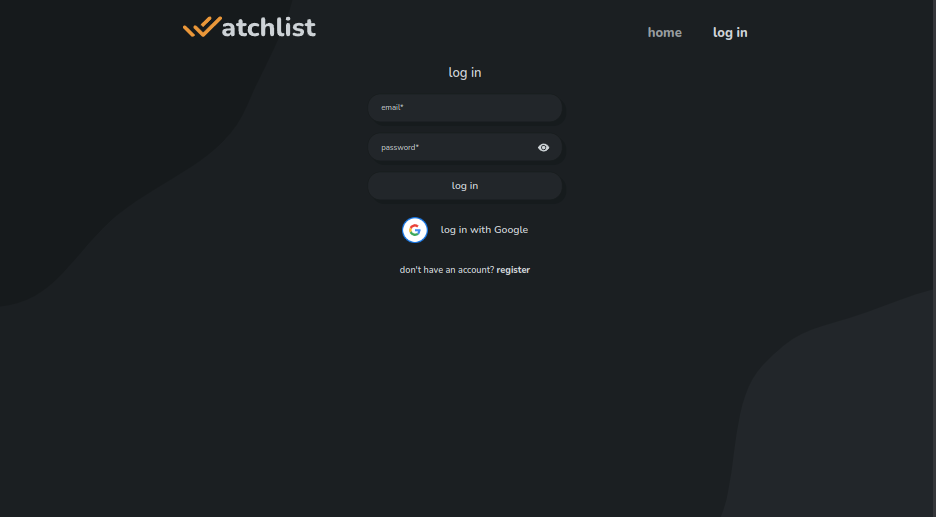

# Watchlist

 

A web app made using the MERN stack.

Users can:

- Discover, search for movies
- See movie details
- Log in/register
- Add movies to their list
- Mark movies as watched
- Rate movies
- Delete movies

 

## Screenshots

#### Home page

#### Movie list

#### Movie details

#### Log in

 

## Tech Stack

#### Frontend

- vite
- react
- react query
- CSS modules
- react-toastify

#### Backend

- node
- express
- mongoDB
- mongoose
- jsonwebtoken
- bcrypt

 

APIs used

- for movies:[TMDB](https://developers.themoviedb.org/3/getting-started/introduction)
- for IMDb scores: [IMDbOT](https://github.com/SpEcHiDe/IMDbOT)

#### How to run locally

1. Clone the repository
2. In your terminal, navigate to the `server` directory and run `npm i`
3. Navigate to the `client` directory and run `npm i`
4. Create `.env` file in `server` directory(see `server/.env.example`)
5. Create `.env` file in `client` directory(see `client/.env.example`)
6. Navigate to the `server` directory and run `npm run dev`
7. In another terminal session navigate to `client` and run `npm run dev`
8. Visit `http://localhost:5173/`
